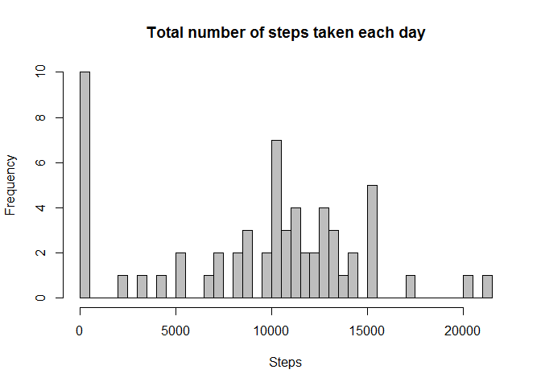
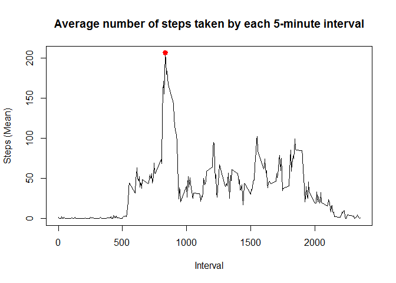
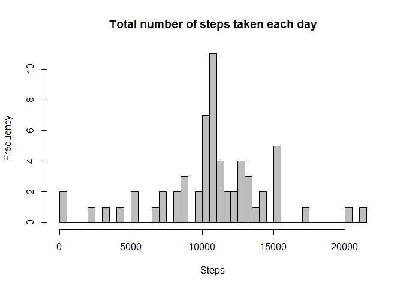
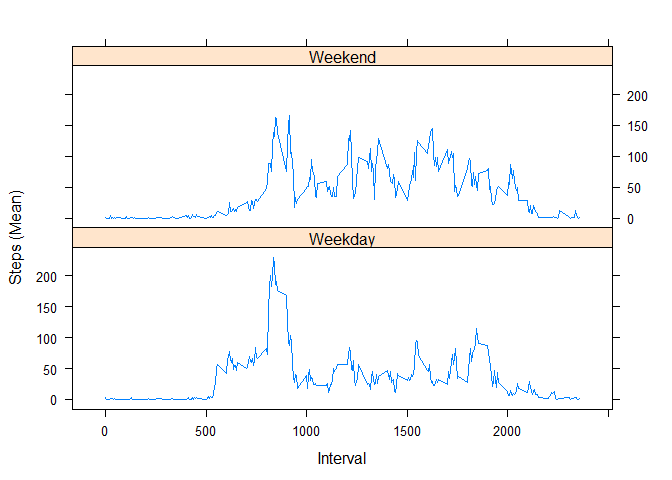

# Reproducible Research: Peer Assessment 1


## Loading and preprocessing the data

We start with unzipping the zip file into a new "activity.csv" file.


```r
unzip("activity.zip")
```

Next we load the csv file into a "data" object.


```r
data <- read.csv("activity.csv")
```

Now we have stored all the information in a "data" object, with a suitable format for the analysis that we need to make.


## What is mean total number of steps taken per day?

Next we store the sum of steps for each day in a new object "aggdata".


```r
aggdata <- aggregate(x = data$steps, by = list(data$date), FUN = "sum", na.rm = TRUE)

names(aggdata) <- c("date", "steps_sum")
```

We can now produce a histogram of the total number of steps taken each day. Since the number of steps is a continuous variable, we group it's value by 50 breaks.


```r
with (
    aggdata, 
    hist (
        aggdata$steps_sum,
        breaks=50,
        col = "gray",
        main = "Total number of steps taken each day",
        xlab = "Steps",
        ylab = "Frequency"
    )
)
```

 

Now we calculate the mean and median of the total number of steps taken per day.


```r
mean(aggdata$steps, na.rm = TRUE)
```

```
## [1] 9354.23
```

```r
median(aggdata$steps, na.rm = TRUE)
```

```
## [1] 10395
```


## What is the average daily activity pattern?

We begin by storing the average number of steps for each 5-minute interval in the object "aggdata".


```r
aggdata <- aggregate(x = data$steps, by = list(data$interval), FUN = "mean", na.rm = TRUE)

names(aggdata) <- c("interval", "steps_mean")
```

We can calculate the 5-minute interval that, on average across all the days in the dataset, contains the maximum number of steps.


```r
maxsteps <- aggdata[which.max(aggdata$steps), ]
```

That interval is **835**, at which the average of steps is **206.1698113**.

Now we can produce a graph with the average number of steps taken by each 5-minute interval, across all days.


```r
with (
    aggdata,
    plot (
        x = interval,
        y = steps_mean,
        type = "l",
        main = "Average number of steps taken by each 5-minute interval",
        xlab = "Interval",
        ylab = "Steps (Mean)"
    )
)

points(maxsteps$interval,  maxsteps$steps_mean, col = 'red', lwd = 3, pch = 19)
```

 


## Imputing missing values
There are a total of **2304** missing values in the dataset.

We will now replace those missing values by the average number of steps for that interval (calculated with the non-missing values).

We start by creating a new auxiliary object that consists on the merge of "data" and "aggdata" objects, that contain, respectively, the original data and the average steps for each 5-minute interval.

Then we replace all the missing values by the mean value of steps for the corresponding interval. Finally we clean the data table.


```r
newdata <- merge(x = data, y = aggdata, by = "interval", all.x = TRUE)

newdata[is.na(newdata$steps), c("steps")] <- newdata[is.na(newdata$steps), c("steps_mean")]

newdata$steps_mean <- NULL
```

We can now produce a histogram of the total number of steps taken each day, with the replaced missing values. We're going to produce the graph in the same exact way as we did before (but now with the replaced missing values).


```r
aggdata <- aggregate(x = newdata$steps, by = list(newdata$date), FUN = "sum")

names(aggdata) <- c("date", "steps_sum")

with (
    aggdata, 
    hist (
        aggdata$steps_sum,
        breaks=50,
        col = "gray",
        main = "Total number of steps taken each day",
        xlab = "Steps",
        ylab = "Frequency"
    )
)
```

 

We can also recalculate the mean and median of the total number of steps taken per day.


```r
mean(aggdata$steps)
```

```
## [1] 10766.19
```

```r
median(aggdata$steps)
```

```
## [1] 10766.19
```

The approach that we used to replace the missing values has some effects on this values, that differ significantly from those estimated at the first part of the assignment.

The mean and median values are alike, which makes sense since we're using mean values to replace missing ones and thus we're overweighting the central tendency and underweighting the upper and lower extremes.

It should also be noted that there is a significant reduction of the frequency of 0 steps during a day. Since we're analysing summed values and we've eliminated several hundreds of missing values, it is significantly less probable to have a summed total of 0 steps per day.


## Are there differences in activity patterns between weekdays and weekends?

For this purpose, we start by turning "date" column into a date class.


```r
newdata$date <- strptime(newdata$date, "%Y-%m-%d")
```

The weekdays() function returns the week day of a given date. It can be used to determine which of the dates from our data correspond to weekdays and to weekends.


```r
newdata$daytype <- as.factor(ifelse(weekdays(newdata$date) %in% c("Saturday","Sunday"), "Weekend", "Weekday"))
```

With this additional information, we can create a plot containing a time series of the 5-minute interval and the average number of steps taken, averaged
across all weekday days or weekend days.

For this, we're going to use the Lattice Ploting System.


```r
aggdata <- aggregate (newdata$steps, by = list (newdata$interval, newdata$daytype), FUN = "mean", na.rm = TRUE)

names(aggdata) <- c("interval", "daytype", "steps_mean")

library(lattice)
xyplot (
    steps_mean ~ interval | daytype,
    data = aggdata,
    type = 'l',
    xlab = 'Interval',
    ylab = 'Steps (Mean)',
    layout = c (1, 2)
)
```

 
